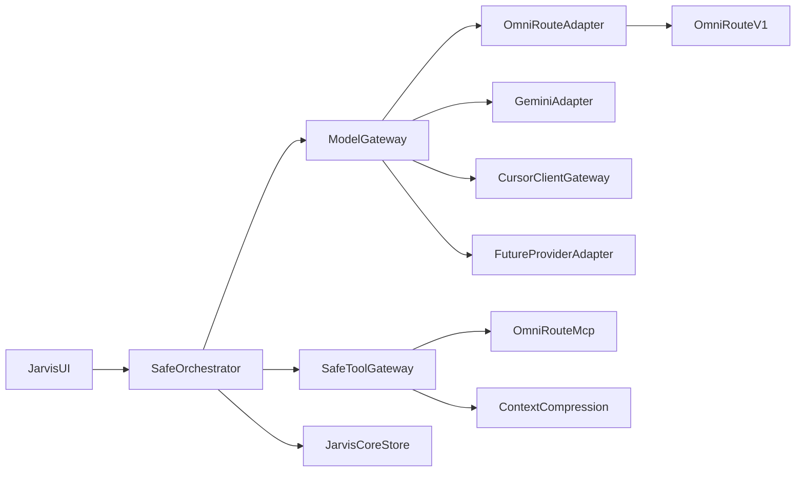

# Plano de integração crítica multi-backend — OmniRoute, Gemini e Cursor

> Documentação incremental dos três itens de maior retorno: gateway multi-provedor, compressão de contexto e catálogo MCP.  
> O Safe Agent Core permanece autoridade de política, aprovações e auditoria.  
> Data: 2026-08-09 · Branch alvo: evolução segura do Jarvis (não substitui V23).

## Objetivo

Permitir selecionar, de forma explícita e auditável, uma destas opções de execução de modelo:

| Opção | Papel |
|-------|--------|
| **OmniRoute** | Gateway local multi-provedor, API OpenAI-compatible em `http://localhost:20128` |
| **Gemini** | API direta do Google via `GEMINI_API_KEY` |
| **Cursor** | Editor/CLI cliente com gateway próprio (`CURSOR_API_KEY` / adaptador `codex`) |

A estrutura aceita **provedores futuros** desde que declarem o mesmo contrato de configuração, saúde, capacidade, privacidade, custo, fallback e auditoria.

## Decisão arquitetural

- Executar OmniRoute como **sidecar local** em `http://localhost:20128`.
- Consumir modelos pela API OpenAI-compatível já suportada (`adapter: openai-compatible`), sem portar `open-sse/executors/` nem fluxos OAuth.
- Conservar Gemini como adaptador direto existente; Cursor como opção de cliente/gateway externo.
- Tratar toda ferramenta OmniRoute (MCP) como integração externa: `SafeToolGateway` + política de workspace + aprovações.
- Memória, UI WebGL, event store e regras de segurança do Jarvis continuam fontes de verdade.



## Arquivos de referência

| Área | Caminho |
|------|---------|
| Aliases V23 | [`config/models.yaml`](../../config/models.yaml) — `local-openai` com `adapter: openai-compatible` |
| Catálogo seguro | [`config/agents.yaml`](../../config/agents.yaml) — privacidade/custo/fallback por modelo |
| OpenAI-compatible | [`src/adapters/openai-compatible.ts`](../../src/adapters/openai-compatible.ts) |
| Factory | [`src/adapters/factory.ts`](../../src/adapters/factory.ts) |
| Gemini | [`src/adapters/gemini.ts`](../../src/adapters/gemini.ts) |
| Model gateway | [`src/core/model-gateway.ts`](../../src/core/model-gateway.ts) |
| Tool gateway | [`src/core/tool-gateway.ts`](../../src/core/tool-gateway.ts), [`src/core/safe-tool-manifests.ts`](../../src/core/safe-tool-manifests.ts) |
| Padrão MCP externo | [`src/integrations/mcp-brasil/`](../../src/integrations/mcp-brasil/) |
| Compressão OmniRoute | `OmniRoute/open-sse/services/compression/` |
| MCP OmniRoute | `OmniRoute/open-sse/mcp-server/server.ts` |

---

# Tópico 1 — Gateway multi-provedor

## Escopo

Documentar a escolha entre OmniRoute, Gemini e Cursor. O Jarvis preserva a seleção segura e delega a execução à rota escolhida, com extensão documentada para provedores futuros.

## Matriz comparativa (obrigatória)

| Critério | OmniRoute | Gemini | Cursor (cliente/gateway) |
|----------|-----------|--------|---------------------------|
| **Mecanismo de auth** | Chave local opcional no sidecar (`LOCAL_OPENAI_API_KEY` / `OMNIROUTE_API_KEY` no sidecar) | `GEMINI_API_KEY` (header `x-goog-api-key`) | `CURSOR_API_KEY` no adaptador `codex` |
| **Variável / config** | `LOCAL_OPENAI_BASE_URL`, `LOCAL_OPENAI_API_KEY`, `LOCAL_OPENAI_MODEL` + alias `local-openai` / `local` | `GEMINI_API_KEY`, `GEMINI_MODEL` (default `gemini-2.5-flash`) + alias `gemini` | Endpoint/credenciais do gateway Cursor; alias `codex` / `cursor-text` no catálogo seguro |
| **Localização do processamento** | Loopback (`localhost:20128`); provedores upstream conforme config do OmniRoute | Cloud Google | Cloud / gateway do Cursor (egress conforme política) |
| **Custo esperado** | Depende do upstream roteado; custo local do sidecar ≈ 0 | `costs_extra: true` no catálogo seguro | `cursor-text` → `costs_extra: false`; rotas OpenAI Cursor → `costs_extra: true` |
| **Streaming** | SSE OpenAI-compatible (`POST /v1/chat/completions`) | SSE Gemini (`streamGenerateContent?alt=sse`) | Conforme adaptador Cursor |
| **Ferramentas (modelo)** | Tool-calling via completions (se o modelo upstream suportar); ferramentas Jarvis sempre via Tool Gateway | Idem, via adaptador | Idem |
| **Rota de fallback** | Em `models.yaml`: `local-openai` → `[gemini]`; em `agents.yaml`: `local` → `[]` (sem escalar cloud sem política) | `gemini` → `[codex-openai]` (safe) / `[deepseek-flash]` (legacy) | `cursor-text` → `[]`; `codex-openai` → `[cursor-text]` |
| **Health** | `GET {LOCAL_OPENAI_BASE_URL}/v1/models` via `checkOpenAICompatibleHealth()` (timeout ~4s) | Disponibilidade = presença de `GEMINI_API_KEY` + resposta da API | Disponibilidade = `CURSOR_API_KEY` + resposta do gateway |
| **Compatibilidade Jarvis** | `OpenAICompatibleTextAdapter` | `GeminiTextAdapter` | `CursorTextAdapter` (alias `codex`) |
| **Limitações conhecidas** | Sidecar precisa estar no ar; fallback interno do OmniRoute deve aparecer no evento de execução | Requer rede e chave Google; não é loopback | Depende do gateway Cursor; não duplicar dashboard OmniRoute |

## Critérios de seleção

1. **OmniRoute** — disponibilidade local, variedade de provedores upstream, um único endpoint OpenAI-compatible.
2. **Gemini** — chamadas diretas à API Google, menor superfície operacional (sem sidecar).
3. **Cursor** — fluxos que precisam partir do editor/CLI com configuração de gateway própria.

Nenhuma opção contorna `model-gateway.ts`, política de egress, orçamento ou aprovações.

## Contrato de extensão (provedor futuro)

Todo novo provedor declara, no mínimo:

| Campo | Descrição |
|-------|-----------|
| `id` / alias | Identificador estável no catálogo (`models.yaml` + `agents.yaml`) |
| `adapter` | Nome registrado em `createTextAdapter` / factory |
| `auth` | Estratégia e variáveis de ambiente |
| `healthProbe` | Função ou endpoint de saúde (ex.: `GET /v1/models`) |
| `capabilities` | Streaming, tools, multimodal, etc. |
| `egressClass` | `local` \| `cloud` \| `hybrid` — alimenta `wouldRouteConfidentialToCloud` / digests |
| `costs` | `costs_extra` + limites de orçamento do agente |
| `limits` | Timeout, rate, tamanho de contexto |
| `models` | IDs suportados |
| `fallbacks` | Lista declarada; nunca cloud sem consentimento/egress aprovado |

Adicionar provedor = config + adaptador que cumpre o contrato. **Proibido** caminho paralelo que ignore o Model Gateway.

## Variáveis de ambiente

### OmniRoute (OpenAI-compatible)

```bash
export LOCAL_OPENAI_BASE_URL="http://localhost:20128"
export LOCAL_OPENAI_API_KEY="not-needed"   # ou chave do sidecar
export LOCAL_OPENAI_MODEL="local"          # ou id do modelo no OmniRoute
```

Pré-condição: OmniRoute escutando em `:20128`.

### Gemini

```bash
export GEMINI_API_KEY="..."
export GEMINI_MODEL="gemini-2.5-flash"     # opcional
```

### Cursor

```bash
export CURSOR_API_KEY="..."
# Endpoint/credenciais do gateway Cursor conforme documentação do adaptador
```

### Futuros

Documentar no mesmo contrato (`env_key`, probe, egress). Exemplo legado ainda não wiring completo: `DEEPSEEK_API_KEY`.

## Health check

Protocolo já implementado para OpenAI-compatible:

1. `GET {LOCAL_OPENAI_BASE_URL}/v1/models`
2. Timeout curto (~4s)
3. Falha → alias indisponível → Model Gateway tenta fallback permitido

Gemini/Cursor: indisponibilidade por credencial ausente ou erro de rede retorna ao gateway (não silenciar).

## Aliases e catálogo

### Legacy / adapter wiring (`config/models.yaml`)

- `local-openai` → `adapter: openai-compatible`, `env_key: LOCAL_OPENAI_BASE_URL`, `fallback: [gemini]`
- `gemini` → `adapter: direct-api`, `env_key: GEMINI_API_KEY`
- `codex` → `adapter: codex-cli`, auth Cursor

### Safe catalog (`config/agents.yaml`)

- `local` → `provider: local`, `costs_extra: false`
- `gemini` → `provider: google`, `costs_extra: true`, `fallback: [codex-openai]`
- `codex-openai` / `cursor-text` → rotas Cursor

Novos aliases seguem o mesmo formato sem alterar a seleção segura.

## Fallback e privacidade

- Sequência explícita por agente via `fallback` no catálogo.
- `buildSafeFallbackAliases` só em erros retryable (`timeout`, `rate_limit`, `server_error`, `unavailable`); máximo documentado no gateway (ex.: 2).
- **Proibido** escalar para cloud sem `allowPaidProvider` / digest de egress (`createCloudEgressDigest`) quando o conteúdo for confidencial.
- Fallback **interno** do OmniRoute (combo/upstream) deve permanecer **visível** no evento de execução Jarvis.

## Mapeamento de erros → Model Gateway

| Condição | Classe esperada |
|----------|-----------------|
| Rate limit | `rate_limit` |
| Timeout | `timeout` |
| Indisponibilidade / 5xx | `unavailable` / `server_error` |
| Auth inválida / chave ausente | erro não retryable (não inventar fallback cloud) |
| Modelo inexistente | erro de configuração |

## Testes (gateway)

- Streaming e seleção por opção (OmniRoute, Gemini, Cursor).
- Health check OmniRoute (`/v1/models`).
- Credencial ausente Gemini/Cursor → indisponível.
- Contrato mínimo de um provedor futuro (fixture de adaptador).
- Fallback Jarvis quando rota indisponível.
- Registro de rota/eventos no core-store.

## Fora de escopo (gateway)

- Portar executors, OAuth ou catálogo de 236 provedores.
- Duplicar dashboard, banco de uso ou combos do OmniRoute.
- Fixar o catálogo a uma lista fechada de três opções.

---

# Tópico 2 — Compressão de contexto

## Escopo

Aplicar compressão **no limite** entre execução de ferramentas e composição de contexto do agente.  
**Nunca** no conteúdo persistido bruto no `core-store`.

## Pipeline

```text
ferramenta executa
  → resultado bruto registrado (core-store / evento)
  → classificador de saída seleciona estratégia
  → conteúdo comprimido enviado ao modelo
```

Aplicabilidade: a compressão fica **antes** do adaptador → beneficia OmniRoute, Gemini, Cursor e provedores futuros de forma uniforme.

## Estratégias

| Ordem | Engine | Quando |
|-------|--------|--------|
| 1 | **RTK** | Terminal, git, Docker, testes, logs |
| 2 | **MCP Accessibility filter** | Snapshots extensos de browser/MCP; preservar IDs de referência para ações futuras |
| 3 | **Caveman** | Texto natural / documentação longa; opt-out se fidelidade literal for obrigatória |

Fonte de referência: `OmniRoute/open-sse/services/compression/` e tools em `mcp-server/tools/compressionTools.ts`.

## Regras de segurança (não comprimir)

- Diffs aguardando aprovação
- Comandos planejados
- Entradas de aprovação
- Hashes / digests
- Resultados pequenos (abaixo do limiar — evitar overhead e perda)

## Telemetria por evento

Cada compressão registra:

- tamanho original
- tamanho enviado
- engine aplicada
- economia percentual
- truncamento (se houver)
- opt-out (se aplicado)

Metadados ficam **separados** do blob bruto no core-store.

## Pontos de extensão

| Ponto | Papel |
|-------|--------|
| `SafeToolGateway` | Aplicar compressão antes da mensagem de resultado da ferramenta |
| Orquestrador seguro | Compor mensagem enviada ao adaptador |
| Eventos do `core-store` | Resultado bruto + metadados de compressão |

## Testes (compressão)

Determinísticos por tipo de saída:

- preservação de caminhos
- códigos de saída
- referências MCP
- dados de aprovação intactos
- assert de “bruto ≠ derivado” no store

---

# Tópico 3 — MCP do OmniRoute

## Escopo

Conectar o Jarvis ao endpoint streamable HTTP `/api/mcp/stream` do OmniRoute e expor **somente** ferramentas explicitamente registradas em manifests do Safe Agent Core.  
Disponibilidade das tools MCP é **independente** da opção de modelo, salvo restrições de capacidade na matriz.

## Transporte

| Modo | Uso |
|------|-----|
| **Streamable HTTP local** com `mcp-session-id` | Produção / integração (recomendado) |
| **stdio** | Desenvolvimento / diagnóstico apenas |

Base: `OMNIROUTE_BASE_URL=http://localhost:20128` (loopback). Token: menor escopo possível (`OMNIROUTE_API_KEY` / scopes MCP). **Nenhum** token ou cabeçalho persiste no `core-store`.

## Primeiro conjunto permitido (allowlist)

| Tool | Risco | Notas |
|------|-------|-------|
| `omniroute_list_models_catalog` | leitura | Catálogo / `/v1/models` |
| `omniroute_check_quota` | leitura | Quota / rate limits |
| `omniroute_best_combo_for_task` | leitura / consultivo | Sem mutação de combos |
| `omniroute_route_request` | efeito externo auditável | Completions via gateway; passa por aprovação se `sideEffect !== none` |
| Tools de compressão **não mutáveis** | leitura | Ex.: `omniroute_compression_status`, `omniroute_list_compression_combos` |

### Inicialmente bloqueadas

Mutações de combo, memória, skills, chaves, configurações, `omniroute_compression_configure`, `omniroute_set_compression_engine`, CCR store write/delete, etc.

## Manifest por ferramenta

Cada tool no Safe Agent Core declara:

- entrada Zod
- escopo (`requiredScopes`)
- `timeoutMs`
- idempotência
- política de aprovação
- serialização / `maxOutputBytes` do resultado
- `risk` / `sideEffect`

Padrão de referência: [`src/integrations/mcp-brasil/`](../../src/integrations/mcp-brasil/) (flag → Zod → allowlist → fetch → disclaimer) e manifests em `safe-tool-manifests.ts`.

## Credenciais e falhas

| Regra | Detalhe |
|-------|---------|
| Endpoint | Apenas loopback |
| Token | Escopo mínimo; não persistir |
| Sessão MCP expirada | Evento normalizado; reconectar sem burlar Tool Gateway |
| Indisponibilidade / erro / resposta incompleta | Eventos normalizados; sem efeito se não aprovado |

## Testes de contrato (mock HTTP MCP)

- Sessão (`mcp-session-id`)
- Allowlist positiva
- Negado por manifesto
- Timeout e cancelamento
- Aprovação para efeito externo
- Saneamento / redaction do resultado

---

# Sequência recomendada de implementação

1. Publicar esta documentação (matriz, contrato extensível, critérios).
2. Configurar e validar cada rota isoladamente: Gemini direto, Cursor gateway, OmniRoute OpenAI-compatible.
3. Implementar ponto de extensão de compressão com RTK em ferramentas de terminal, sem alterar registro bruto.
4. Adicionar cliente MCP com allowlist mínima de leitura.
5. Validar streaming, cancelamento, auditoria, regressão de aprovações e isolamento de workspace.
6. Só então expandir tools MCP, estratégias de compressão e regras de fallback.

---

# Critérios de aceite

- [x] Documentação diferencia OmniRoute, Gemini e Cursor (config, auth, limitações, escolha).
- [x] Novo provedor entra pelo contrato sem contornar `model-gateway.ts`, egress, auditoria ou aprovações.
- [x] Alias `local` via OmniRoute OpenAI-compatible (`LOCAL_OPENAI_*`); Gemini/Cursor adapters preservados.
- [x] Resultados grandes de terminal chegam comprimidos (RTK-lite) ao modelo; core-store conserva bruto + meta no evento.
- [x] Tools MCP OmniRoute de leitura exigem flag, loopback, manifest e allowlist (`JARVIS_OMNIROUTE_MCP=1`).
- [ ] Queda/lentidão/resposta inválida de qualquer rota não contorna fallback/cancelamento/consentimento (regressão Safe Core).
- [ ] `omniroute_route_request` e mutações MCP — próximo incremento.

## Relação com o plano Safe Agent Core

Este plano **não** substitui [`jarvis-evolution-core.md`](jarvis-evolution-core.md). Complementa as etapas 5–6 (Tool Gateway / Model Gateway) com a superfície OmniRoute e compressão, sem reabrir políticas globais do Safe Agent Core.
